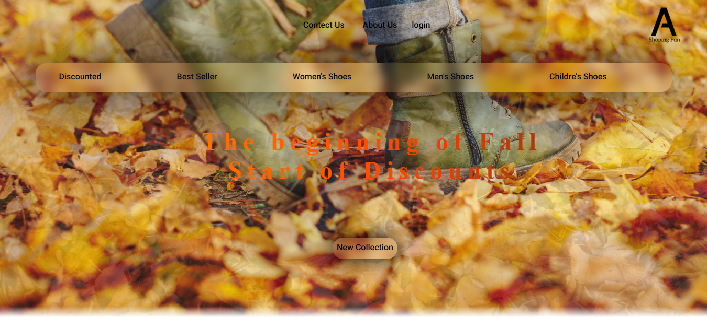
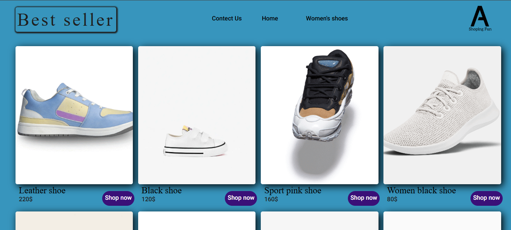

# 🛒 E-Commerce Website

Eine einfache E-Commerce-Website als persönliches Webentwicklungsprojekt.

## ✨ Features

- 🛍️ Produktübersicht
- 🔎 Produktsuche
- 🛒 Warenkorb
- 📱 Responsive Design
- 🎨 Benutzerfreundliche Oberfläche

## 🛠️ Technologien

- HTML
- CSS
- JavaScript
- TypeScript

## 📸 Screenshots

### Homepage

### Best Seller

## 🚀 Live Demo

👉 [Website öffnen](https://ariansalimii.github.io/wcommerce-website/)

## 💻 Source Code

👉 [GitHub Repository](https://github.com/Ariansalimii/wcommerce-website)

## 📌 Über das Projekt

Dieses Projekt wurde entwickelt, um meine Kenntnisse in der Webentwicklung
praktisch anzuwenden und meine Erfahrungen mit HTML, CSS, JavaScript und
TypeScript zu erweitern.

## 👨‍💻 Autor

**Arian Salimi**

📧 ariansalimialibaglou@gmail.com
